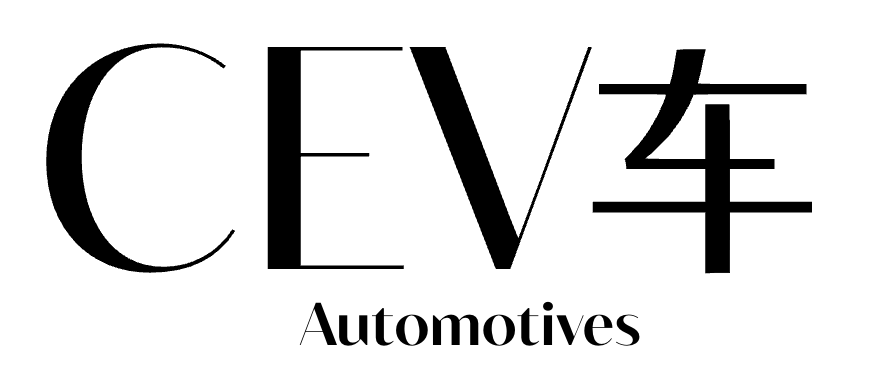

# Ceva Automotives

## Introdução

Ceva Automotives é uma plataforma para gestão de locadora de veículos.

##  Sobre o Projeto

Este sistema foi projetado para atender às necessidades de locadoras de veículos, oferecendo funcionalidades distintas para **Administradores** e **Clientes**, com uma arquitetura robusta e escalável.

##  Principais Funcionalidades

### Para Administradores
- **Gestão de Frota**: Cadastro, edição e controle de status dos veículos
- **Gestão de Clientes**: Visualização e administração da base de clientes
- **Gestão de Reservas**: Controle completo do processo de locação
- **Dashboard Executivo**: Métricas em tempo real e indicadores de performance
- **Relatórios Avançados**: Análises financeiras e operacionais com exportação

### Para Clientes
- **Catálogo Interativo**: Navegação e busca de veículos disponíveis
- **Sistema de Reservas**: Processo simplificado de locação online
- **Gestão de Perfil**: Controle de dados pessoais e preferências
- **Histórico de Locações**: Acompanhamento de reservas passadas e futuras
- **Avaliações**: Sistema de feedback para melhoria contínua

## Tecnologias

- **Backend**: FastAPI
- **Frontend**: React.js com TypeScript
- **Banco de Dados**: PostgreSQL

